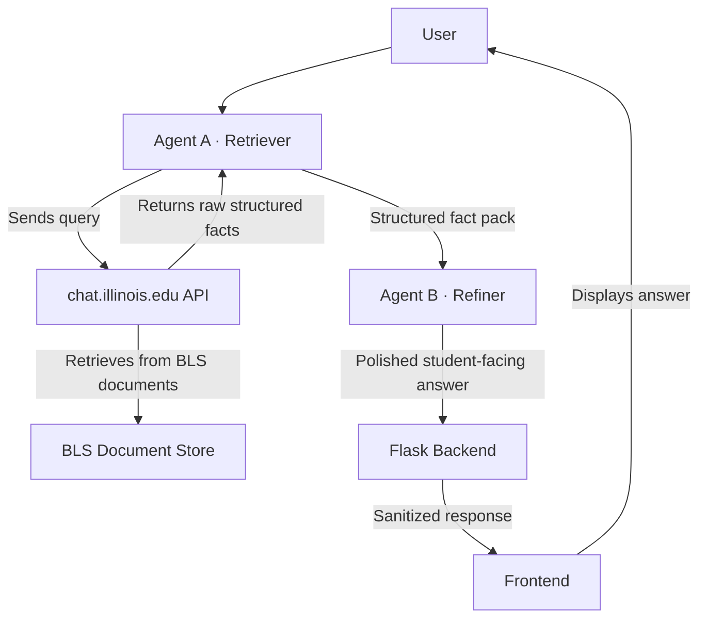

# BLS Virtual Advisor

An AI-powered chatbot for the **Bachelor of Liberal Studies (BLS)** program at the University of Illinois. Uses a dual-agent pipeline — Agent A retrieves grounded facts from BLS documents, Agent B refines them into a clean, student-facing response.

---

## System Architecture



---

## Tech Stack

- **Backend:** Python, Flask, LangChain, Requests
- **Frontend:** Vanilla HTML/CSS/JS (no framework required)
- **LLM API:** [chat.illinois.edu](https://chat.illinois.edu) — free NCSA-hosted model with document retrieval
- **Default model:** `Qwen/Qwen2.5-VL-72B-Instruct`

---

## Setup

### 1. Clone and install dependencies

```bash
git clone https://github.com/aakashkolli/bls-chatbot.git
cd bls-chatbot
python -m venv venv
source venv/bin/activate       # Windows: venv\Scripts\activate
pip install -r requirements.txt
```

### 2. Configure environment variables

Create a `.env` file in the project root:

```env
UIUC_CHAT_API_KEY=your_api_key_here
COURSE_NAME=bls-chatbot-v2
MODEL=Qwen/Qwen2.5-VL-72B-Instruct
```

> Get your API key from [chat.illinois.edu](https://chat.illinois.edu).

---

## Main Script — `scripts/bls_chat.py`

**Location:** [`scripts/bls_chat.py`](scripts/bls_chat.py)

This is the core chatbot logic. It runs the full dual-agent pipeline as a standalone interactive CLI — no server or browser required. It contains the canonical system prompts (Agent A and Agent B) and the `sanitize_user_response()` function used by the web backend.

**What it does:**

1. Takes your question as input
2. Sends it to Agent A (Retriever) → structured fact extraction from BLS documents
3. Passes Agent A's output to Agent B (Refiner) → clean, student-facing answer
4. Prints the final response

**Run:**

```bash
cd /Users/kolli/bls-chatbot
source venv/bin/activate
python scripts/bls_chat.py
```

**Example session:**

```text
BLS Virtual Advisor  |  model: Qwen/Qwen2.5-VL-72B-Instruct  |  course: bls-chatbot-v2
Type 'quit' or 'exit' to stop.

You: How much does the BLS program cost?
[Agent A] Retrieving facts...
[Agent B] Refining response...

Advisor:
- **Tuition per credit:** $433 ...
```

---

## Frontend Components

All three Flask-served components share the same backend. Start it first:

```bash
cd /Users/kolli/bls-chatbot
source venv/bin/activate
python app.py
# Server starts at http://localhost:5001
```

> **Note:** Port 5001 is used because macOS reserves port 5000 for AirPlay Receiver.

---

### 1. Full-Page Chat Interface

**File:** [`frontend/index.html`](frontend/index.html)
**URL:** `http://localhost:5001/`

The primary chat interface — a full-viewport page showing the conversation, agent pipeline status, and a message input area.

**Features:**

- Live **Agent A → Agent B pipeline bar** that appears during processing, with animated pulse dots showing which agent is active
- **Typewriter streaming effect** — bot responses animate in character-by-character once the pipeline completes
- Quick-question chips on first load for common BLS questions
- Auto-resizing textarea, per-message timestamps
- Illinois navy + orange branding

**Screenshot layout:**

```text
┌─────────────────────────────────────────┐
│  🎓 BLS Virtual Advisor   ● AI Online   │  ← top bar
├─────────────────────────────────────────┤
│  ● Agent A · Retriever → Agent B ·      │  ← pipeline bar (visible during processing)
├─────────────────────────────────────────┤
│                                         │
│   [Bot message]                         │  ← messages
│                        [User message]   │
│                                         │
├─────────────────────────────────────────┤
│  [ Type your question...        ] Send  │  ← input
└─────────────────────────────────────────┘
```

---

### 2. Floating Widget

**File:** [`frontend/widget.html`](frontend/widget.html)
**URL:** `http://localhost:5001/widget`

A self-contained floating chat bubble and panel. Designed to be embedded inside an `<iframe>` on any external webpage. Manages its own open/close state internally.

**Features:**

- Circular floating button (bottom-right corner) with spring open/close animation
- Notification badge on first load
- Same agent pipeline bar and typewriter streaming as the full-page version
- "Online" status indicator in the header
- Compact 390×580 px panel — fits cleanly inside an iframe

**View it standalone:**

```text
http://localhost:5001/widget
```

---

### 3. Embeddable Script

**File:** [`frontend/embed.js`](frontend/embed.js)
**URL:** `http://localhost:5001/embed.js`

A single `<script>` tag that injects the widget iframe into **any** external webpage — no framework, no build step required.

**Usage — add to any HTML page:**

```html
<script src="http://localhost:5001/embed.js"></script>
```

The script automatically:

1. Creates a fixed-position `<iframe>` pointing to `/widget`
2. Appends it to `<body>` once the DOM is ready
3. The chat bubble appears bottom-right — fully functional

**Example host page:**

```html
<!DOCTYPE html>
<html>
<head><title>My Page</title></head>
<body>
  <h1>Welcome to the BLS program page</h1>
  <!-- BLS advisor widget -->
  <script src="http://localhost:5001/embed.js"></script>
</body>
</html>
```

---

### 4. Next.js Embed Host

**File:** [`frontend/embed-nextjs/`](frontend/embed-nextjs/)
**URL:** `http://localhost:3000` (runs separately from Flask)

A Next.js application that serves as a React-based host for the embedded widget. Runs independently of the Flask server.

**Run:**

```bash
cd /Users/kolli/bls-chatbot/frontend/embed-nextjs
npm install
npm run dev
# Opens at http://localhost:3000
```

> The Flask backend (`python app.py`) must also be running for the embedded widget to function.

---

## API Endpoints

| Method | Endpoint | Description |
| ------ | -------- | ----------- |
| `GET` | `/` | Full-page chat UI |
| `GET` | `/widget` | Floating widget UI |
| `GET` | `/embed.js` | Embeddable script |
| `POST` | `/api/stream` | **SSE stream** — emits agent status events then the final answer |
| `POST` | `/api/chat` | Non-streaming JSON response (widget fallback) |
| `POST` | `/api/ask` | Non-streaming JSON response (full-page fallback) |

### `/api/stream` event format

The frontend connects to this endpoint via the [Fetch Streaming API](https://developer.mozilla.org/en-US/docs/Web/API/Streams_API). Events are Server-Sent Events (SSE):

```text
data: {"type": "agent_status", "agent": "A", "message": "Retrieving facts from BLS documents…"}

data: {"type": "agent_status", "agent": "B", "message": "Refining response for you…"}

data: {"type": "answer", "content": "The BLS program costs ..."}

data: {"type": "done"}
```

---

## Project Structure

```text
bls-chatbot/
├── app.py                          # Flask server — routes, dual-agent pipeline, SSE endpoint
├── scripts/
│   └── bls_chat.py                 # ★ Main chatbot script — CLI, canonical prompts, sanitizer
├── frontend/
│   ├── index.html                  # Full-page chat UI
│   ├── widget.html                 # Floating embeddable widget
│   ├── embed.js                    # Drop-in embed script
│   └── embed-nextjs/               # Next.js host app
├── config/
│   └── system_prompts.json         # Exported system prompts
├── bls_model_eval_pipeline/        # Evaluation scripts and result JSONs
├── requirements.txt
├── .env                            # Not committed — add your keys here
└── README.md
```

---

## Environment Variables

| Variable | Required | Default | Description |
| -------- | -------- | ------- | ----------- |
| `UIUC_CHAT_API_KEY` | Yes | — | API key for chat.illinois.edu |
| `COURSE_NAME` | Yes | `bls-chatbot-v2` | Course namespace for document retrieval |
| `MODEL` | No | `Qwen/Qwen2.5-VL-72B-Instruct` | LLM model name |
| `GEMINI_API_KEY` | No | — | Optional — enables Gemini model routing |
