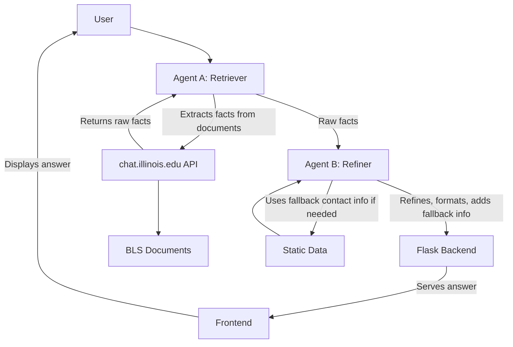

# BLS Chatbot

A chatbot for the Bachelor of Liberal Studies (BLS) program at the University of Illinois.

## System Flow

## Two-Agent Approach

Two agents are used: one retrieves facts, the other refines and formats answers for clarity and accuracy.

## Tech Stack

- Python (Flask, LangChain)
- HTML, CSS, JavaScript
- Requests (API calls)

## External Services

- chat.illinois.edu: document-grounded answers, free NCSA-hosted LLM
